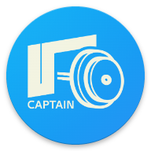

<a id="readme-top"></a>


<br />
<div align="center">
  <a href="https://github.com/GaafarBBK/captain">
    
  </a>

<h3 align="center">Captain</h3>

  <p align="center">
    <br />
  
  </p>
</div>


## About The Project

A fitness-tracking app where users can buy online coaching subscriptions and follow tailored workouts with dynamic tracking of calories burned and progress.


## Information


### Features
<ul>
<li>Workout Selection & Tracking: Filter workouts by muscle group and set specific goals.</li>
<li>Step Count & Calorie Calculator: Real-time tracking that calculates calories based on user weight.</li>
<li>Exercise Data Integration: Uses a public API to pull detailed exercise data.</li>
</ul>

### Work In Progress (WIP)
<ul>
<li>Captain’s Dashboard: Allowing trainers to create and assign custom workouts to subscribers.</li>
<li>User Subscriptions: Letting users subscribe to captains for personalized workout plans.</li>
<li>Scheduled Workouts: Customizable workout plans for specific days and durations.</li>
</ul>

### Additional notes
Late submission was due to the Github servers being down.

The server is on Mohamed Gaafar's PC, when you want to turn it on contact me (contact details below)


## Installation & Setup


1. Clone the repo

   
   ```sh
   git clone https://github.com/GaafarBBK/captain.git
   ```


2. Run pub get
   ```sh
   flutter pub get
   ```

### Testing

- **APK for Testing**: [Download APK](./flutter-apk/app-release.apk) to test the mobile app.
  
- **API Testing**: Use the provided [Postman Collection](./postman/Captain.postman_collection.json) for easy backend testing and validation of API endpoints.


## Contact

<ul>
  <li>Mohamed Gaafar - mohamedgaafar80@gmail.com</li>
  <li>Abdulrahman Rushdie - bdwm83249@gmail.com</li>

</ul>


